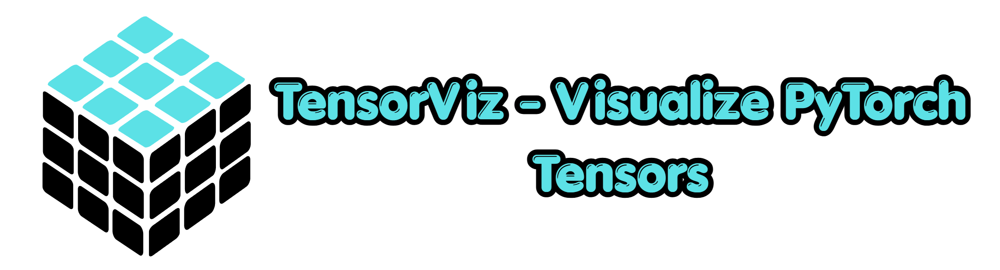
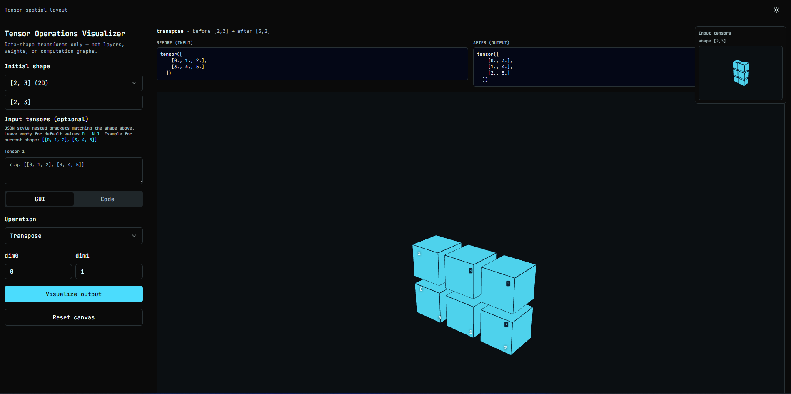

<p align="center">
  
</p>

<p align="center">
  <b><em>Supercharge Your Tensor Operations Understanding 🚀</em></b><br>
  Explore PyTorch tensor workflows visually in an interactive 3D environment.
</p>

<p align="center">
  <a href="https://tensorviz.netlify.app/"></a>
  
  
  
</p>

<p align="center">
  <a href="https://tensorviz.netlify.app/"><b>Live Demo</b></a> | 
  <a href="#quick-start"><b>Quick Start</b></a> | 
  <a href="#repository-layout"><b>Architecture</b></a> | 
  <a href="#docker-deployment"><b>Docker</b></a>
</p>

---

## ⚡ Overview

**TensorViz** is a developer-focused, full-stack application for visualizing PyTorch tensor operations in real-time. Whether you're debugging complex dimensional transformations or simply learning tensor manipulaton basics, TensorViz provides an intuitive 3D representation where you can see shapes and values change after each operation.

- **Backend:** High-performance **FastAPI** service running live **PyTorch** computations natively.
- **Frontend:** Slick **React + Vite** SPA powered by **React Three Fiber** for declarative 3D modeling.

<p align="center">
  
</p>

---

## 🏗️ Repository Layout (Monorepo)

- **Backend/** — Python/FastAPI API (/api/visualize, /health). Uses uv for blazing-fast dependency management via pyproject.toml / uv.lock.
- **Frontend/** — React + TS SPA. Dependencies are managed natively with **Bun** (package.json, bun.lock).

> 💡 **Note on API Routing:** The frontend communicates with the API via the VITE_API_URL environment variable (defaults to http://127.0.0.1:8000 for local dev). In production, it targets our Hugging Face Space endpoint.

---

## 🚀 Quick Start (Local Development)

### 1. Start the Backend

From the repository root:

```powershell
cd backend
uv sync
uv run uvicorn app.main:app --reload --host 0.0.0.0 --port 8000
```
*(Requires [uv](https://docs.astral.sh/uv/) and Python >= 3.11)*

### 2. Start the Frontend

In a secondary terminal window:

```powershell
cd frontend
bun install
bun run dev
```

Open **http://localhost:5173**. Ensure the backend is operational on port 8000 (or redefine `VITE_API_URL` in Frontend/.env).

---

## 🐳 Docker Deployment

To build and start the complete application layer (frontend + backend) using Docker Compose from the **repository root**:

```shell
docker compose up --build
```

- **Frontend UI:** http://localhost:5173
- **Backend API:** http://localhost:8000
- **Health Check:** http://localhost:8000/health

### Container Architecture Notes
- **Backend Image:** Inherits from the Astral [ghcr.io/astral-sh/uv](https://ghcr.io/astral-sh/uv) base. It executes uv sync --frozen and runs Uvicorn. PyTorch is locked to the official **CPU-only wheel** to negate pulling massive CUDA/NVIDIA layers into ordinary deployments.
- **Frontend Image:** Powered by [**oven/bun**](https://hub.docker.com/r/oven/bun). Implements layer caching by sequentially copying package.json && bun.lock, installing, building (bun run build), and locally exposing the static assets over port 5173.
